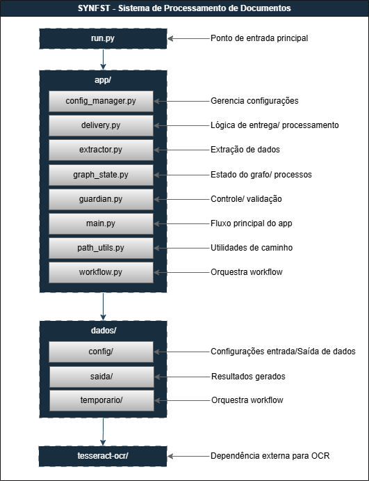

# SYNFST - Sistema de Processamento de Documentos Fiscais de Serviços Tomados

**Grupo:** ProcessIA  
**Participantes:** Davi | Eduardo | Eliezer | Kimberly | Roberto

## Descrição

Desenvolvido para automatizar a leitura, extração e processamento de dados de documentos fiscais de serviços tomados, o agente de IA foi projetado para reduzir o trabalho manual dos analistas contábeis e garantir maior precisão e agilidade na escrituração fiscal.
A solução é capaz de processar arquivos em PDF e imagens, identificando e extraindo automaticamente as informações essenciais das notas fiscais de serviços emitidas contra a empresa tomadora.
Seu foco principal é organizar os dados fiscais em um formato padronizado, pronto para ser lançado tanto no sistema interno da contabilidade quanto nos portais municipais e na Receita Federal.

---

## Principais Funcionalidades

- **Recuperação de documentos fiscais:** Permite importar e processar notas fiscais de serviços tomados a partir de diferentes fontes, em formatos PDF ou imagem, garantindo abrangência e flexibilidade no tratamento dos dados.
- **Extração inteligente de dados:** Emprega técnicas de Reconhecimento Óptico de Caracteres (OCR) para converter documentos digitalizados em texto, e Processamento de Linguagem Natural (NLP) para interpretar, classificar e estruturar as informações extraídas de forma contextual e semântica.
- **Identificação de informações fiscais:**
  - Dados do emitente e destinatário
  - Detalhamento dos serviços tomados (descrição, valores, retenções de tributos)
  - Informações sobre impostos incidentes (ISS, INSS, PIS, COFINS, IRRF etc.)
  - Códigos fiscais e de operação (CFOP, CNAE, CST e outros)
- **Geração de relatórios e planilhas:** Os dados extraídos são organizados e exportados em planilhas e relatórios compatíveis com sistemas de gestão contábil e escrituração fiscal, prontos para envio às prefeituras e órgãos federais.
- **Interface intuitiva:** O sistema oferece uma interface simples e funcional, permitindo o upload de documentos, visualização dos resultados processados e configuração personalizada de relatórios, facilitando a operação por equipes contábeis.

---

## Público Alvo

Empresas, escritórios de contabilidade e profissionais da área fiscal que necessitam processar grandes volumes de documentos fiscais de forma automatizada, ágil e precisa.
Também atende equipes de tecnologia e automação contábil que buscam incorporar soluções inteligentes de leitura e extração de dados em seus fluxos de trabalho, reduzindo erros manuais e otimizando o tempo gasto em tarefas repetitivas.
Além disso, a solução é ideal para desenvolvedores, analistas e integradores de sistemas que desejam implementar rotinas de extração e padronização de dados fiscais em plataformas próprias, facilitando processos de escrituração, auditoria e análise tributária em conformidade com as exigências dos órgãos municipais, estaduais e federais.

---

## Justificativa

A crescente demanda por agilidade, precisão e conformidade no processamento de documentos fiscais têm impulsionado a necessidade de soluções inteligentes e automatizadas. No contexto contábil e tributário, empresas e escritórios de contabilidade enfrentam diariamente o desafio de lidar com grandes volumes de notas fiscais de serviços, emitidas em diferentes formatos e padrões.
O processo manual de extração, conferência e lançamento de informações é repetitivo, sujeito a falhas humanas e consome tempo que poderia ser direcionado a atividades mais analíticas e estratégicas. Esse cenário reforça a importância da automação como ferramenta essencial para garantir eficiência operacional e segurança fiscal.
Diante desse desafio, o SYNFST foi desenvolvido para transformar o modo como as informações fiscais são tratadas. A plataforma realiza a importação, leitura e extração automática dos dados de documentos fiscais, eliminando tarefas manuais e acelerando o fluxo de escrituração. Sua estrutura baseada em inteligência artificial, OCR e NLP assegura a identificação precisa de campos fiscais e a integração eficiente com sistemas de gestão e órgãos governamentais.
Além de otimizar o tempo e reduzir custos operacionais, o SYNFST contribui para elevar o nível de confiabilidade e transparência das informações contábeis, permitindo que os profissionais concentrem seus esforços em análise de resultados, auditorias e planejamento tributário estratégico. Assim, o projeto representa um avanço significativo na modernização dos processos contábeis e na adoção de tecnologias que fortalecem a governança e a produtividade empresarial.

---

## 🛠️ Detalhamento da Solução

### Principais Funções Desenvolvidas

- 📥 **Importação de Documentos:** Permite ao usuário importar arquivos PDF ou imagens contendo documentos fiscais, diretamente pela interface web.
- ⚡ **Processamento Automático:** Após o upload, o sistema realiza a segmentação dos documentos, identifica múltiplas notas em um mesmo arquivo e prepara o conteúdo para extração.
- 🧠 **Reconhecimento Óptico de Caracteres (OCR):** Aplica OCR para converter imagens ou PDFs digitalizados em texto, garantindo que informações contidas em imagens sejam processadas corretamente.
- 🤖 **Extração Inteligente de Dados:** Utiliza modelos de IA para interpretar o texto extraído e identificar campos relevantes, como dados do emitente, destinatário, itens da nota, impostos e códigos fiscais.
- ✅ **Validação e Enriquecimento dos Dados:** Realiza validações automáticas e, quando necessário, solicita complementação ou correção de informações ao usuário.
- 📊 **Geração de Relatórios e Planilhas:** Exporta os dados extraídos em formatos compatíveis com sistemas de gestão, facilitando a escrituração fiscal e a análise tributária.
- 🛠️ **Configuração de Provedores de IA:** Permite ao usuário configurar diferentes provedores de inteligência artificial para o processamento dos documentos, tornando a solução flexível e adaptável.
- 📋 **Logs e Monitoramento:** Exibe logs detalhados no terminal e permite acompanhamento do processamento para facilitar o diagnóstico de problemas.

---

## 🖥️ Como a Solução é Operada

### Inicialização

- Navegue até a pasta SYNFST e execute SYNFST.exe. O sistema abrirá automaticamente a interface web no navegador em <http://127.0.0.1:7860>.

### Upload de Documentos

- Pela interface web, selecione e envie arquivos PDF ou imagens para processamento.

### Configuração

- Configure as chaves de API dos provedores de IA e ajuste parâmetros conforme necessário.

### Processamento

- O sistema realiza a extração e validação dos dados automaticamente, exibindo o progresso e os resultados na interface.

### Exportação

- Baixe relatórios ou planilhas com os dados extraídos, prontos para integração com outros sistemas.

### Acompanhamento

- Monitore logs e mensagens de status exibidos no terminal para acompanhamento e resolução de eventuais problemas.

---

## 🏗️ Arquitetura

---

## 🧰 Tecnologias Utilizadas

- Python 3.8+
- Gradio (interface web)
- LangGraph (orquestração de agentes IA)
- PyMuPDF (processamento de PDFs)
- Tesseract OCR (extração de texto)
- Pandas (manipulação de dados)
- PyInstaller (empacotamento)
- Modelos de IA: Google Gemini, OpenAI, Anthropic, Mistral, Groq, Ollama

---

## 📄 Licença

Este projeto está licenciado sob a Licença MIT. Consulte o arquivo [LICENSE](./LICENSE) para mais detalhes.

---

## 🤝 Como Contribuir

Contribuições são bem-vindas! Para colaborar com o projeto:

1. Faça um fork deste repositório.
2. Crie uma branch para sua feature ou correção (`git checkout -b minha-feature`).
3. Faça suas alterações e commit (`git commit -m 'Minha contribuição'`).
4. Envie um pull request explicando sua proposta.

Sugestões, melhorias e correções serão analisadas pela equipe ProcessIA.
